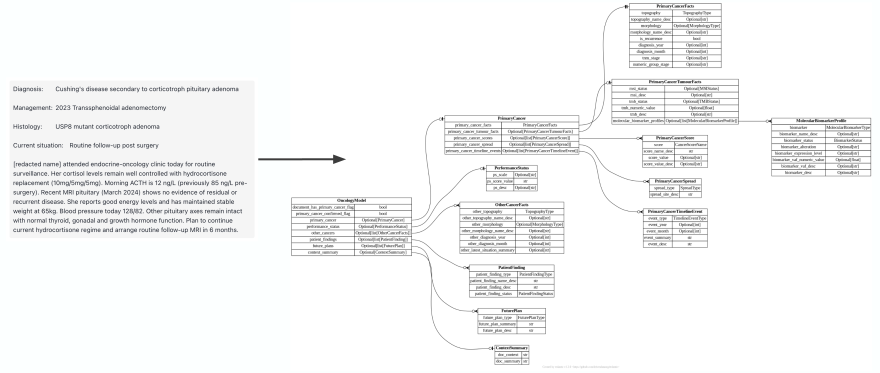
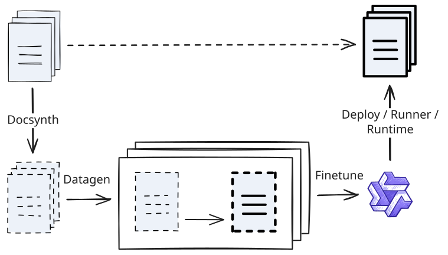

# MESA (Medical entity Extraction with Schema Alignment)

MESA standardises free-text patient data under a schema of choice, in order to enable downstream activities such as analytics and clinical trial recruitment.

  

## Pre-requisites

- [uv](https://docs.astral.sh/uv/getting-started/installation/)

## Getting started

General repository requirements are listed below.
In additional, different components have different pre-requisites, which are also listed below and referenced in individual notebooks.

### Repo

1. Initiate example data (stored as a Git submodule): `git submodule update --init`

2. Install repo-wide package dependencies with `uv sync`.

### AWS Credentials

Some MESA components leverage AWS services such as Bedrock and S3.
This guide assumes these resources have already been configured by suitable MESA Infrastructure as Code (IaC).
It also assumes an AWS account is available for use.
With these things in place:

1. Obtain a Bedrock API key from your account manager.

2. Obtain general access to AWS from your account manager and follow the instructions [here](https://docs.commonfate.io/granted/getting-started) to set up SSO authentication for use of the AWS CLI. Run `assume --env` to place credentials in a `.env` file.

3. Obtain information on a Bedrock Execution IAM Role with S3 and model access and information on the name of an S3 bucket to upload a batch specification to. Place this information in the `.env` file as `BUCKET` and `BEDROCK_EXECUTION_ROLE`, respectively.

### MESA Runtime credentials

MESA Runtime, which provides training and inference orchestration, has its own credentials, which should also be placed into a `.env` file as `BASE_URL` (provided URL of MESA Runtime's server), `USERNAME` and `PASSWORD`.

### MESA Deploy credentials

MESA Deploy, which collects model weights and runs them via a library (_offline_) or exposes them via a server (_remote_), has its own credentials, which should also be placed into a `.env` file as `WEIGHTS_ID` (a form of username) and `WEIGHTS_KEY` (a form of password).

## Components

MESA consists of a number of different components that work together to support the training of data standardisation models:

1. Docsynth leverages an understanding of the structure of the real free-text data to build a synthetic corpus that emulates a wide range of possible real documents.
This corpus is built using a large foundation model.

2. Datagen passes each of these synthetic documents to (the same) foundation model, along with a custom schema containing target fields of interest (derived from domain knowledge). The model is prompted to standardise each document to the schema, creating a set of pairs illustrating the standardisation process.

3. Finetune uses these pairs to train a smaller, open source model. This is supported by the Runtime orchestration.

4. Deploy provides an environment in which these fine-tuned models can be used for inference against the real documents. This is paired with Runner (also orchestrated by Runtime), which efficiently gathers data to use as input to Deploy.

  

This repository contains a notebook for each component, illustrating the standardisation process in practice.
